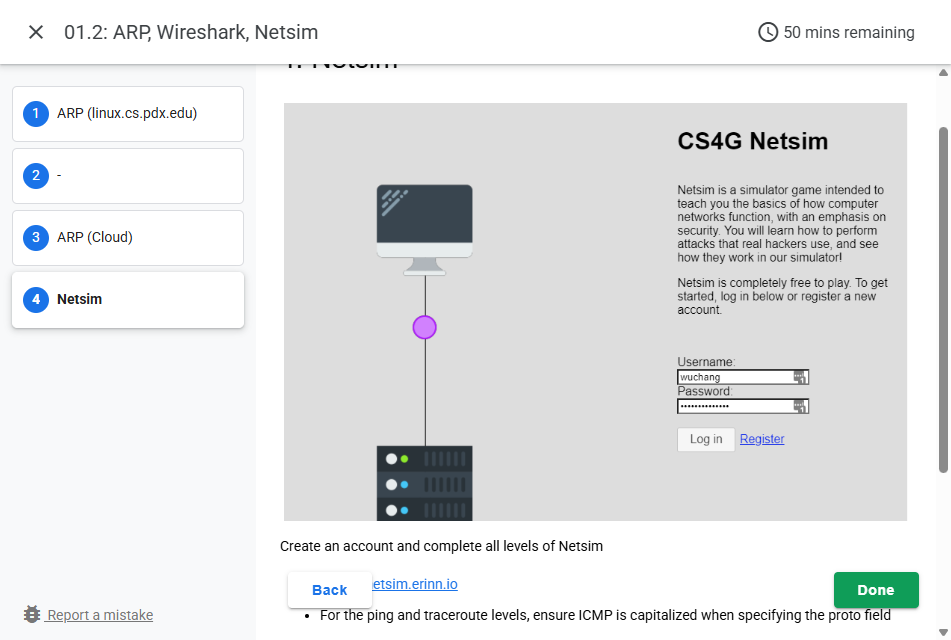

# Lab 01.2: ARP, Wireshark, Netsim

## 1. ARP (linux.cs.pdx.edu)

In this lab, we'll examine the ARP on a linux server. ssh into linux.cs.pdx.edu.

Use the `ip address` command to find the IPv4 address and hardware address of the local ethernet card interface (Typically beginning with `eth`, `ens`, or `enp`).

- Include both in your lab notebook

Perform a `netstat -rn` to list the route table for the machine.

- What is the default router's IP address (e.g. the gateway address for the default route 0.0.0.0/0)

Perform an `arp` command (both with and without the `-n` flag) on the IP address of the router.

- What is the name of the default router and its hardware address?

Next, we'll examine the ARP table on the server. Perform the command below to list the entire table.

```bash
arp -a
```

As the output shows, there are a number of machines directly connected to this server. The command outputs the DNS name, the IP address, and the hardware address of each. We can pipe the output of the command to `wc -l` to determine the number of entries in the table.

```bash
arp -a | wc -l
```

- How many entries are there in the ARP table?

---

## 2. -

To remove duplicates, we can then count the total number of hardware addresses in the ARP table.

```bash
arp -a | sort -k 4 | awk '{print $4}' | uniq | wc -l
```

- How many less hardware addresses are there than IP addresses in the ARP table?

We can use `awk` to generate a list of IP addresses. Note that IP addresses are enclosed in parentheses. `awk` uses space as a default delimiter. However, we can use the `-F` flag for `awk` to specify alternate delimiters. For example, `-F ' [()]'` uses either a parenthesis character as a delimiter.

Use a single command-line to create a file that contains each IP address that appears in the machine's ARP table and places the results in a file called `arp_entries`. The command should be similar to the one below:

```bash
arp -an | awk -F ' [()]' '{print $2}' > arp_entries
```

- Include the command in your lab notebook

Examine the `arp_entries` file:

- What network prefix do most of the IP addresses in the ARP table share?

---

## 3. ARP (Cloud)

In Cloud Shell, bring up your Ubuntu VM.

```bash
gcloud compute instances start <name_of_VM>
```

ssh into the VM and install the net-tools package that includes arp and netstat.

```bash
sudo apt update -y
sudo apt install net-tools -y
```

Find the IP address and hardware address of the local ethernet card interface (Typically beginning with eth, ens, or enp).

```bash
ip address
```

- Include both in your lab notebook

Then, examine the route table for the machine.

```bash
netstat -rn
```

- What is the default router's IP address (e.g. the gateway address for the default route 0.0.0.0/0)

Finally, find the hardware address of the default router by using arp to resolve its IP address

```bash
arp <IP_address_of_router>
```

- What is the default router's hardware address?

---

## 4. Netsim

**CS4G Netsim**

Netsim is a simulator game intended to teach you the basics of how computer networks function, with an emphasis on security. You will learn how to perform attacks that real hackers use, and see how they work in our simulator!

Netsim is completely free to play. To get started, log in below or register a new account.

**Network Diagram:**



**Create an account and complete all levels of Netsim**

- http://netsim.erinn.io
- For the ping and traceroute level, ensure ICMP is capitalized when specifying the proto field
- For the traceroute level, it is solved in two steps. The first identifies the hidden router, the second pings each one.

**Upon completion of all levels:**

- Take a screenshot of the completed list of levels including your OdinID

