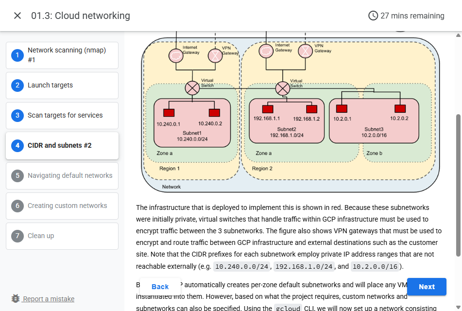
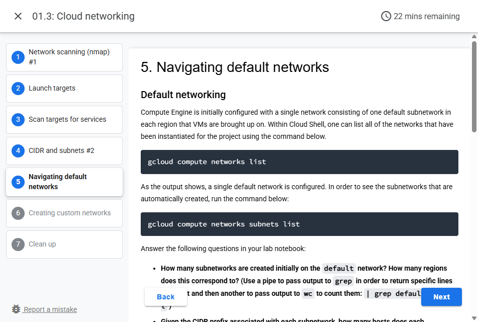
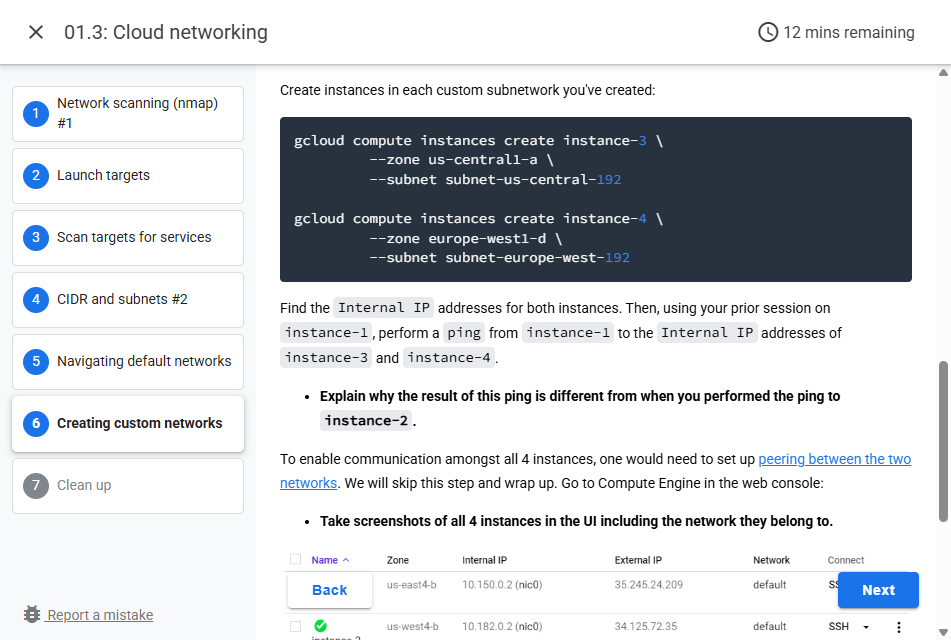

# Lab 01.3: Cloud networking

## 1. Network Scanning (nmap) #1

This lab will give you experience with Google Cloud's Marketplace as well with `nmap`, a standard tool for performing network security audits.

On the Linux VM you've created on Google Cloud, start up your instance, then `ssh` into it.

```bash
gcloud compute instances start course-vm
gcloud compute ssh course-vm
```

When connected to the VM, run the following to install `nmap` on it.

```bash
sudo apt update
sudo apt install nmap -y
```

We will be using the VM to scan the Marketplace deployments that we will be launching on Compute Engine.

## 2. Launch target

**Option #1: Marketplace (credit-card may be required)**

Go to Marketplace on the Google Cloud Platform console.

Filter on Virtual Machines, then on Blog & CMS. These solutions, when deployed, will bring up their software on a Compute Engine instance.

Deploy a WordPress instance from the Marketplace. This will create a Compute Engine instance that you can scan with nmap.

## 3. Scan target for service

Go to the Marketplace on the Google Cloud Platform console. Go to the original VM you installed nmap on. (If you've logged out, click on SSH to log back into it). Then, run nmap on the internal subnet the instances have been placed on:

```bash
nmap 10.x.y.z/24
```

You should see a list of ports that each machine exposes over the network. This provides administrators important data for taking an inventory of their infrastructure in order to ensure only a minimal set of services are exposed.

- Show a screenshot of the output for the scan for your lab notebook.

**Clean-up**

For servers launched via the Marketplace, in the web console, visit "Deployment Manager". Marketplace solutions are all done via this "Infrastructure-as-Code" solution for Google Cloud Platform. We can take solutions down from its console.

## 4. CIDR and Subnets #2

"Lift-and-shift" deployments in the cloud aim to create a virtual equivalent of an existing network configuration. The "Customer Site" in the figure below wishes to migrate three internal, private subnetworks into the cloud across three different availability zones.



The diagram shows:
- Customer Site connected to Customer Gateway via VPN
- Cloud environment with two Availability Zones (Zone a and Zone b)
- Zone a contains:
  - Subnet1: 10.240.0.0/24 with instances 10.240.0.1 and 10.240.0.2
  - Subnet2: 192.168.1.0/24 with instances 192.168.1.1 and 192.168.1.2
- Zone b contains:
  - Subnet3: 10.2.0.0/16 with instances 10.2.0.1 and 10.2.0.2
- Each zone has Internet Gateway, VPN Gateway, and Virtual Switch components

## 5. Navigating default network

### Default networking

Compute Engine is initially configured with a single network consisting of one default subnetwork in each region that VMs are brought up on. Within Cloud Shell, one can list all of the networks that have been created:

```bash
gcloud compute networks list
```

As the output shows, a single default network is configured. In order to see the subnetworks that are automatically created, run the command below:

```bash
gcloud compute networks subnets list
```

Answer the following questions in your lab notebook:

- How many subnetworks are created initially on the default network? How many regions does this correspond to? (Use a pipe to pass output to grep in order to return specific lines of output and then annotate)

- Given the CIDR prefix associated with each subnetwork, how many hosts does each subnetwork support?

Create two instances in different zones in separate regions of your choice:

```bash
gcloud compute instances create instance-1 --zone=<zone-1>
gcloud compute instances create instance-2 --zone=<zone-2>
```

List both instances.

- Which CIDR subnetworks are these instances brought up in? Do they correspond to the appropriate region based on the prior command?

Visit the Compute Engine console. In the Column Display option, add the "Network" column if it is not yet selected.



Then, SSH into instance-1 via the UI


From instance-1, perform a ping to the Internal IP address of instance-2. Take a screenshot of the output.


- From the figure in the previous step. What facilitates this connectivity: the virtual switch or the VPN Gateway?

Leave the session on instance-1 active for the next step.

## 6. Creating custom network

Bring up a Cloud Shell session.

### Custom networking

GCP allows one to create custom network configurations. To show this, within Cloud Shell, create a second network called custom-network1 and additionally configure it to allow the custom configuration:

```bash
gcloud compute networks create custom-network1 --subnet-mode=custom
```

Use the command from the previous step to see our project now has both the default and custom network.

Then, create two custom subnetworks within custom-network1 in regions us-central1 and europe-west1. For both subnetworks, specify a /24 CIDR prefix:

```bash
gcloud compute networks subnets create custom-subnet1 --network=custom-network1 --region=us-central1 --range=10.1.0.0/24
gcloud compute networks subnets create custom-subnet2 --network=custom-network1 --region=europe-west1 --range=10.2.0.0/24
```

Use the command from the previous step to list the subnetworks for the custom network.

Then, list all subnetworks for the two regions.

- Take a screenshot of the new subnets created in custom-network1 alongside the default subnetworks in those regions assigned to the default network.

Create instances in each custom subnetwork you've created:

```bash
gcloud compute instances create instance-3 --zone=<zone-in-us-central1> --subnet=custom-subnet1
gcloud compute instances create instance-4 --zone=<zone-in-europe-west1> --subnet=custom-subnet2
```

Find the Internal IP addresses for both instances. Then, using your prior session on instance-1, perform a ping from instance-1 to the Internal IP address of instance-3 and instance-4.

- Explain why the result of this ping is different from when you performed the ping to instance-2.

To enable communication amongst all 4 instances, one would need to set up peering between the two networks. We will skip this step and wrap up. Go to Compute Engine in the web console:

- Take screenshots of all 4 instances in the UI including the network they belong to.



Then visit "VPC Network" and visit each network.

- Take a screenshot of the subnetworks created for the custom-network1 network and some of the subnetworks of the default network showing their regions, internal IP ranges and Gateway.

## 7. Clean up

Delete the VMs, subnetworks, and network. Note that if you wish to avoid the prompt to continue, you can pass the `--quiet` flag to each command.

```bash
gcloud compute instances delete instance-1 --zone <zone_one>
gcloud compute instances delete instance-2 --zone <zone_two>
gcloud compute instances delete instance-3 --zone us-central1-a
gcloud compute instances delete instance-4 --zone europe-west1-d
gcloud compute networks subnets delete subnet-us-central-192 --region us-central1
gcloud compute networks subnets delete subnet-europe-west-192 --region europe-west1
gcloud compute networks delete custom-network1
```

